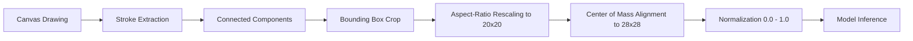

<div align="center">

# 🖊️ Handwritten Digit Recognition
### An Interactive Deep Learning & Machine Learning Web Application for MNIST Classification

[](https://www.python.org/)
[](https://streamlit.io/)
[](https://www.tensorflow.org/)
[](https://scikit-learn.org/)
[](https://git-lfs.github.com/)
[](LICENSE)

<br/>

<p align="center">
  <b>A state-of-the-art interactive web application built with Streamlit, TensorFlow, and Scikit-Learn that allows users to draw single or multi-digit numbers on a digital whiteboard and evaluates predictions in real time using Deep Learning (CNN, MLP) and Classical Machine Learning (Random Forest).</b>
</p>

</div>

---

## 👥 Project Team Members

This project was developed collaboratively by our dedicated team of machine learning engineers:

| Avatar | Name | GitHub Profile | Role / Contributions |
| :---: | :--- | :--- | :--- |
|  | **Mohamed Tamer** | [@MohameddTamerr](https://github.com/MohameddTamerr) | Project Architecture, Full-Stack Streamlit App, Canvas State Management & Preprocessing Pipeline |
|  | **Menna Allah Mohamed** | [@mennaaadell](https://github.com/mennaaadell) | Deep Learning Model Training (CNN & MLP), Hyperparameter Tuning & Model Serialization |
|  | **Farida Sherif** | [@FaridaObied](https://github.com/FaridaObied) | Machine Learning Baseline (Random Forest), Data Preprocessing & Validation Analysis |
|  | **Ahmed Ramy** | [@ahmedramy10](https://github.com/ahmedramy10) | Multi-Digit Segmentation, Bounding Box Extraction & Center-of-Mass Mathematical Alignment |
|  | **Marwan Ragab** | [@marwan-ragab](https://github.com/marwan-ragab) | Comparative Performance Evaluation, Confidence Visualization & Model Benchmarking |

---

## 📊 Model Evaluation & Benchmarks

All models were systematically trained, validated, and evaluated on the official **MNIST Handwritten Digit Dataset** (60,000 training images, 10,000 test images) within [`1_keras_sequential_exercise.ipynb`](1_keras_sequential_exercise.ipynb):

### Comprehensive Performance Comparison

| Model | Architecture Highlights | Input Shape | Test Accuracy | Training Time | Parameters / Estimators |
| :--- | :--- | :---: | :---: | :---: | :---: |
| 🥇 **Convolutional Neural Network (CNN)** | Conv2D (32, 3×3) + MaxPool (2×2) + Dense (128) + Softmax | `(1, 28, 28, 1)` | **98.38%** | 84.54 s | 693,962 parameters |
| 🥈 **Multilayer Perceptron (MLP)** | Dense (256, ReLU) + Dropout (0.2) + Softmax (10) | `(1, 784)` | **98.00%** | 80.25 s | 203,530 parameters |
| 🥉 **Random Forest Classifier** | 150 Decision Trees, $\sqrt{\text{features}}$, `min_samples_leaf=1` | `(1, 784)` | **96.98%** | 23.60 s | 150 estimators |

### 🔍 Architectural Analysis & Insights

- **Convolutional Neural Network (CNN)**: Achieved the highest accuracy (**98.38%**). Convolutional kernels effectively extract local spatial patterns (edges, loops, stroke crossings), while max pooling provides translation invariance, making the CNN resilient to handwritten shifts and slight position offsets.
- **Multilayer Perceptron (MLP)**: Delivered competitive accuracy (**98.00%**) with fewer parameters (203K vs 693K). While fast and effective, fully connected layers treat pixels independently and lack inherent 2D spatial context.
- **Random Forest**: Served as an excellent classical machine learning baseline (**96.98%**). It trains rapidly (23.6s) without requiring neural gradient descent or GPU acceleration, demonstrating the strength of ensemble decision trees on tabularized pixel intensities.

---

## 🌟 Key Application Features

- **Interactive Whiteboard Canvas**:
  - Full freehand drawing with smooth, lag-free client-side stroke persistence.
  - Zero-flicker re-renders with optimized asset caching.
- **Complete Creative Toolset**:
  - **Draw Mode & Rubber (Eraser)**: Switch seamlessly between pen strokes and selective rubber erasing.
  - **Undo & Redo**: Full stack-based stroke history allows stepping forward and backward through edits.
  - **Quick Clear**: One-click whiteboard reset.
  - **Brush Sizing**: Small, Medium, and Large stroke thicknesses.
  - **Curated 7-Color Palette**: Aubergine, Violet, Peach, Coral, Black, Blue, and Teal.
- **Multi-Digit Segmentation**:
  - Automatically isolates and segments multiple handwritten numbers drawn side-by-side.
  - Recognizes multi-digit sequences (e.g., `771`, `42`, `108`) with individual digit thumbnails and aggregate confidence scoring.
- **Model X-Ray & Transparency**:
  - Visualizes the normalized $28 \times 28$ image as processed by the neural network.
  - Interactive probability distribution bars illustrating top candidate predictions.
- **Tailored Aesthetic UI**:
  - Elegant ambient background with floating pastel numbers.
  - Crisp vector SVG icons matching the unified design palette.
  - Micro-animations for card elevation, prediction pop-in, and smooth progress transitions.

---

## 🔬 Image Preprocessing Pipeline

To guarantee that drawings made in the web browser match the exact distribution of MNIST training images, each canvas stroke undergoes a mathematical preprocessing pipeline:



1. **Stroke Extraction & Background Inversion**: Isolates foreground pixels regardless of stroke color by computing Euclidean distance from the background.
2. **Multi-Digit Segmentation**: Identifies connected components and sorts them horizontally from left to right.
3. **Bounding Box Isolation**: Tight crops each individual digit to remove redundant whitespace.
4. **Aspect-Ratio Preserved Rescaling**: Scales the largest dimension to 20 pixels while preserving the original aspect ratio.
5. **Center of Mass Alignment**: Embeds the digit into a $28 \times 28$ frame, translating the center of mass to $(13.5, 13.5)$ matching MNIST standard centering.
6. **Pixel Intensity Normalization**: Scales pixel values to $[0.0, 1.0]$ (`pixel / 255.0`).
7. **Tensor Reshaping**: Formats tensors into `(1, 28, 28, 1)` for CNN or `(1, 784)` for MLP and Random Forest.

---

## 🛠️ Technologies Used

- **Deep Learning**: [TensorFlow](https://www.tensorflow.org/) & [Keras](https://keras.io/)
- **Classical Machine Learning**: [Scikit-Learn](https://scikit-learn.org/) & [Joblib](https://joblib.readthedocs.io/)
- **Web Application & UI**: [Streamlit](https://streamlit.io/) & [streamlit-drawable-canvas](https://github.com/andfanilo/streamlit-drawable-canvas)
- **Computer Vision & Array Computation**: [NumPy](https://numpy.org/), [Pillow](https://python-pillow.org/), [SciPy](https://scipy.org/)
- **Version Control & Large File Storage**: [Git](https://git-scm.com/) & [Git LFS](https://git-lfs.github.com/)

---

## 📁 Repository Structure

```
handwritten-digit-recognition/
├── .streamlit/
│   └── config.toml               # Streamlit theme & server configuration
├── assets/
│   ├── app_icon.png              # Application logo icon
│   └── bg_optimized.jpg          # Optimized pastel numbers background
├── models/
│   ├── mnist_cnn.keras           # Trained Convolutional Neural Network
│   ├── mnist_mlp.keras           # Trained Multilayer Perceptron
│   └── mnist_random_forest.joblib# Trained Random Forest (Tracked with Git LFS)
├── utils/
│   ├── __init__.py
│   ├── preprocessing.py          # Segmentation, center of mass, normalization
│   └── prediction.py             # Inference pipeline & model caching
├── 1_keras_sequential_exercise.ipynb # Training & benchmark notebook
├── app.py                        # Streamlit web application
├── requirements.txt              # Production dependencies
├── .gitignore                    # Ignored artifacts & cache
└── README.md                     # Project documentation
```

---

## 🚀 Getting Started

### 1. Clone the Repository

Ensure **Git LFS** is installed before cloning to download the large model files:

```bash
git lfs install
git clone https://github.com/MohameddTamerr/handwritten-digit-recognition.git
cd handwritten-digit-recognition
```

### 2. Create and Activate a Virtual Environment

```bash
# Windows
python -m venv venv
venv\Scripts\activate

# macOS / Linux
python3 -m venv venv
source venv/bin/activate
```

### 3. Install Dependencies

```bash
pip install -r requirements.txt
```

### 4. Run the Application

```bash
streamlit run app.py
```

The application will launch automatically in your default browser at **`http://localhost:8501`**.

---

## ☁️ Deployment

This application is ready for one-click deployment on **Streamlit Community Cloud**:

1. Fork or push this repository to your GitHub account.
2. Sign in to [share.streamlit.io](https://share.streamlit.io/).
3. Select your repository, set the branch to `main`, and specify `app.py` as the main file path.
4. Click **Deploy!**

---

## 📄 License

This project is licensed under the **MIT License** — feel free to use and adapt it for academic and educational purposes.
